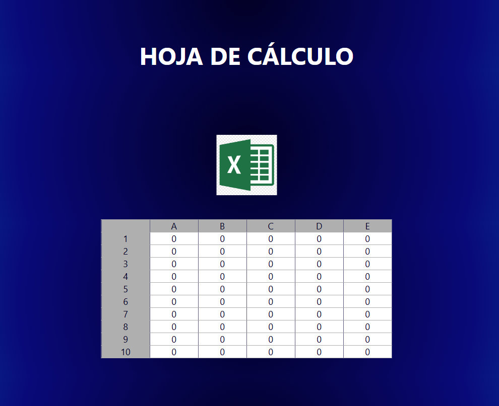

# 📊 Mini Excel JS

<p align="center">
  
</p>

<p align="center">
  
  
  
  
  
</p>

<p align="center">
  <a href="https://github.com/alobuuls/mini-excel-js" target="_blank"></a>
  <a href="https://github.com/alobuuls/mini-excel-js/stargazers" target="_blank"></a>
  <a href="https://github.com/alobuuls/mini-excel-js/commits/main" target="_blank"></a>
</p>

---

## 📑 Table of Contents

* [📊 Mini Excel JS](#-mini-excel-js)

  * [📑 Table of Contents](#-table-of-contents)

  * [🌐 Live Demo](#-live-demo)

  * [📖 Description](#-description)

  * [⚙️ System Requirements](#️-system-requirements)

  * [🔍 Verify Installation](#-verify-installation)

  * [🚀 Project Installation](#-project-installation)

    * [1️⃣ Clone the repository](#1️⃣-clone-the-repository)
    * [2️⃣ Open the project](#2️⃣-open-the-project)

  * [▶️ Run the Project](#️-run-the-project)

  * [🧠 Project Architecture](#-project-architecture)

    * [📦 Core Modules](#-core-modules)

      * [Spreadsheet Engine](#spreadsheet-engine)
      * [Formula Processor](#formula-processor)
      * [Column Management](#column-management)
      * [Clipboard Interactions](#clipboard-interactions)

  * [✨ Features](#-features)

  * [🧮 Example Formulas](#-example-formulas)

  * [🛠 Technologies Used](#-technologies-used)

  * [📁 Project Structure](#-project-structure)

  * [🔥 Best Practices Implemented](#-best-practices-implemented)

  * [🎯 Project Goal](#-project-goal)

  * [📄 License](#-license)

---

## 🌐 Live Demo

🔗 https://alobuuls.github.io/mini-excel-js/

---

## 📖 Description

> [!NOTE]
> Mini Excel JS is a spreadsheet-inspired application built with HTML, CSS, and Vanilla JavaScript.

The project recreates core spreadsheet functionality directly in the browser, allowing users to edit cells, calculate formulas, select columns, copy data, and dynamically update values without using external libraries or frameworks.

---

## ⚙️ System Requirements

Before running the project, make sure you have:

* 🌐 A modern web browser (Chrome, Firefox, Edge, Safari)
* 📦 Git (optional)

---

## 🔍 Verify Installation

Check that Git is installed:

```bash
git --version
```

---

## 🚀 Project Installation

### 1️⃣ Clone the repository

```bash
git clone https://github.com/alobuuls/mini-excel-js.git

cd mini-excel-js
```

### 2️⃣ Open the project

> [!IMPORTANT]
> No dependencies or package installation are required.

You can simply open:

```text
index.html
```

or run the project using Live Server in Visual Studio Code.

---

## ▶️ Run the Project

Open the `index.html` file directly in your browser.

---

## 🧠 Project Architecture

> [!NOTE]
> The application is built using Vanilla JavaScript and follows a state-driven approach for managing spreadsheet data.

### 📦 Core Modules

#### Spreadsheet Engine

Responsible for:

* Cell rendering
* State management
* Data synchronization
* Dynamic updates

#### Formula Processor

Handles:

* Formula parsing
* Mathematical operations
* Cell references
* Automatic recalculation

#### Column Management

Manages:

* Column selection
* Bulk editing
* Data clearing
* Spreadsheet interactions

#### Clipboard Interactions

Controls:

* Copy functionality
* Keyboard shortcuts
* User productivity features
* Data extraction

---

## ✨ Features

* 📦 Dynamic cell editing
* ➗ Excel-style formulas
* ⚡ Automatic calculations
* 📋 Full column selection
* ⌨️ Copy values with CTRL + C
* 🧹 Clear columns using Backspace
* 🔄 Reactive updates
* 🧠 In-memory state management
* 📊 Spreadsheet-like experience
* 🚀 Lightweight implementation without frameworks

---

## 🧮 Example Formulas

```txt
=A1+B1
=A1*10
=B2-C1
```

---

## 🛠 Technologies Used

| Technology        | Purpose           |
| ----------------- | ----------------- |
| HTML5             | Structure         |
| CSS3              | Styling           |
| JavaScript (ES6+) | Functionality     |
| DOM API           | DOM Manipulation  |
| Event Listeners   | User Interactions |
| Arrays & Objects  | Data Management   |
| Clipboard API     | Copy Operations   |

---

## 📁 Project Structure

```text
mini-excel-js/
├── index.html
├── main.js
├── styles.css
├── img/
│   ├── preview.png
│   └── excel-img.png
└── README.md
```

---

## 🔥 Best Practices Implemented

* Separation of responsibilities
* Dynamic DOM rendering
* State-driven architecture
* Formula abstraction
* Reusable functions
* Event delegation concepts
* Clean code structure
* Spreadsheet data modeling
* Maintainable JavaScript logic
* Lightweight implementation

---

## 🎯 Project Goal

Practice and strengthen advanced JavaScript concepts through the creation of a spreadsheet-like application:

* DOM Manipulation
* Event Handling
* State Management
* Dynamic Rendering
* Formula Parsing
* Spreadsheet Logic
* Arrays & Objects
* Data Synchronization
* User Interaction Design
* Front-End Architecture

---

## 📄 License

This project is intended for educational and portfolio purposes.

Created by **Alondra Francisco Onofre**.
